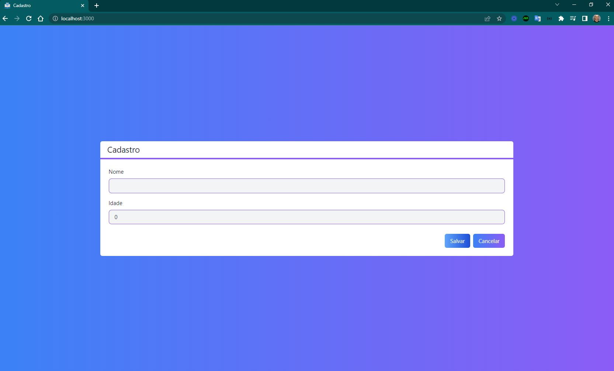

<h4 align="center"> 
	🚧 Cadastro 🚀
</h4> 

<p align="center" style="display: flex; align-items: flex-start; justify-content: center;"> 
   
</p> 

## 🎨 Projeto

- Projeto de cadastro com todo o fluxo crud.

## 🎨 Layout

<p align="center" style="display: flex; align-items: flex-start; justify-content: center;"> 
    
   
</p> 

## 💻 Tecnologias

- [x] 1. Html, css, javascript, jsx
- [x] 2. React: componentes, props, estado
- [x] 3. Node
- [x] 4. Componente de classe 
- [x] 5. Componente funcional em react com [hooks](https://reactjs.org/docs/hooks-intro.html)
- [x] 6. navegação com react-router
- [x] 7. Formulário
- [x] 8. API
- [x] 9. Nextjs 
- [x] 10. Tailwind Css 
- [x] 11. Firebase Console 

## 💻 Detalhes do projeto

This is a [Next.js](https://nextjs.org/) project bootstrapped with [`create-next-app`](https://github.com/vercel/next.js/tree/canary/packages/create-next-app).

### Getting Started

First, run the development server:

```bash
npm run dev
# or
yarn dev
```

Open [http://localhost:3000](http://localhost:3000) with your browser to see the result.

You can start editing the page by modifying `pages/index.js`. The page auto-updates as you edit the file.

[API routes](https://nextjs.org/docs/api-routes/introduction) can be accessed on [http://localhost:3000/api/hello](http://localhost:3000/api/hello). This endpoint can be edited in `pages/api/hello.js`.

The `pages/api` directory is mapped to `/api/*`. Files in this directory are treated as [API routes](https://nextjs.org/docs/api-routes/introduction) instead of React pages.

### Learn More

To learn more about Next.js, take a look at the following resources:

- [Next.js Documentation](https://nextjs.org/docs) - learn about Next.js features and API.
- [Learn Next.js](https://nextjs.org/learn) - an interactive Next.js tutorial.

You can check out [the Next.js GitHub repository](https://github.com/vercel/next.js/) - your feedback and contributions are welcome!

### Deploy on Vercel

The easiest way to deploy your Next.js app is to use the [Vercel Platform](https://vercel.com/new?utm_medium=default-template&filter=next.js&utm_source=create-next-app&utm_campaign=create-next-app-readme) from the creators of Next.js.

Check out our [Next.js deployment documentation](https://nextjs.org/docs/deployment) for more details.

## 🚀 Construído projeto 

- [x] 1. Um crud com Next.JS: `npx create-next-app cadastro`, `cd cadastro` e `npm run dev`
- [x] 2.1. TailwindCss: `npm install -D tailwindcss@latest postcss@latest autoprefixer@latest`
- [x] 2.2. TailwindCss: `npx tailwindcss init -p`
- [x] 3. Firebase Console: criar o bd cloud firebase
- [x] 4. Mudado o formato do index para `tsx`
- [x] 5. Criar o arquivo tsconfig.json
- [x] 6. Instalar `npm install --save-dev @types/react typescript`
- [x] 7. Instalar extensão Tailwind CSS IntelliSense
- [x] 8. Heroicons: ícones edit e trash
- [x] 9. Firebase: `npm install firebase`
- [x] 9.1. Configuração do db - firebase/config.ts 
- [x] 10. Organizando código com Hooks
- [x] 11. Firestore deletado devido a informações sensíveis
- [x] 12. favicon hooks
- [x] 13. título da página
- [x] 14. fonts google 

### 🚀 Variáveis locais

projeto cadastro no firebase console
NEXT_PUBLIC_FIREBASE_API_KEY="informações no projeto no firebase console"
NEXT_PUBLIC_FIREBASE_AUTH_DOMAIN="informações no projeto no firebase console".firebaseapp.com
NEXT_PUBLIC_FIREBASE_PROJECT_ID="informações no projeto no firebase console"

## 🚀 Seções 

- [x] Princípios de Nextjs e React [82 - 104] 
- [x] Projeto Cadastro [105 - 122] 

## 📝 Licença

Este projeto esta sobe a licença MIT.

Feito com ❤️ por Douglas A B Novato 👋🏽 [Entre em contato!](https://www.linkedin.com/in/douglasabnovato/)
 
Fonte do projeto Por Leonardo Moura Leitão no [Curso React + Redux: Fundamentos e 2 Apps do Absoluto ZERO!](https://www.udemy.com/course/react-redux-pt/), [Cod3r](https://www.cod3r.com.br/), [Github Cod3r](https://github.com/cod3rcursos/next-crud)
